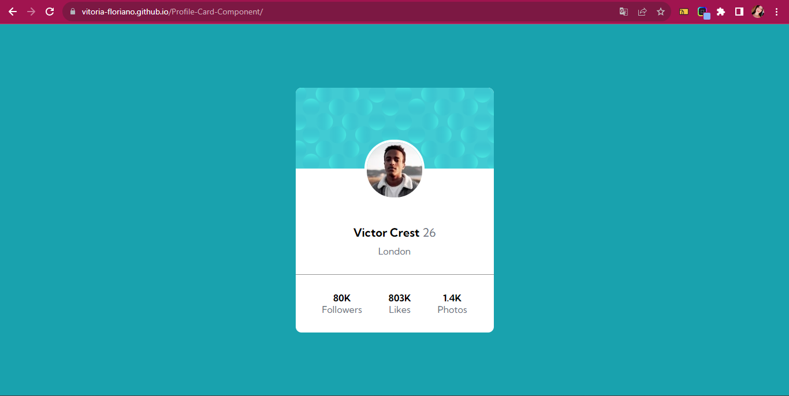

# Frontend Mentor - Profile card component solution

This is a solution to the [Profile card component challenge on Frontend Mentor](https://www.frontendmentor.io/challenges/profile-card-component-cfArpWshJ). Frontend Mentor challenges help you improve your coding skills by building realistic projects. 

## Table of contents

  - [The challenge](#the-challenge)
  - [Screenshot](#screenshot)
  - [My process](#my-process)
  - [Built with](#built-with)
  - [What I learned](#what-i-learned)
  - [Continued development](#continued-development)

### The challenge

- Build out the project to the designs provided

### Screenshot

## My process

I had some difficulty with the centralization, especially of the container itself, but I managed to understand better when asking for help, and thus I was able to open my vision a little more and better study some semantics and organizations in the code.

### Built with

- Semantic HTML5 markup
- CSS custom properties
- Flexbox
- CSS Grid
- Mobile-first workflow
- [Styled Components](https://styled-components.com/) - For styles

### What I learned

I had some difficulty with centralization, especially the container itself, but I managed to understand better when asking for help, some coworkers helped me, and so I was able to open my vision a little more and better study some semantics and organizations in the code.

### Continued development

I liked thinking this way, it made me realize that I can think about solving a problem, from other points of view, I always apply this in my personal life, but seeing myself in this situation was really cool.
